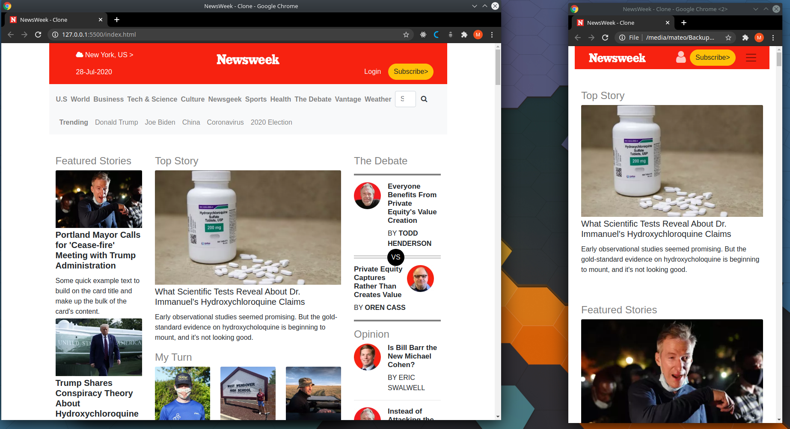

# NewsWeek Clone Page

> The purpose of this project was to clone the newsweek landing page and its responsiveness.

All the elements in the page are responsive using bootstrap classes and scripts for the different sizes of screens.

## Built With

- HTML, CSS
- BOOTSTRAP
- VSCODE

## Live Demo

[Live Demo Link](https://raw.githack.com/mateomh/newsweek-clone/newsweek-page/index.html)

## Authors

👤 **Mateo mojica**

- Github: [@mateomh](https://github.com/mateomh)
- Twitter: [@mateo_m_h](https://twitter.com/mateo_m_h)
- Linkedin: [linkedin](https://linkedin.com/mateo_mojica_hernandez)

👤 **Enrique Ramirez**

- Github: [@nrqrmz]( https://github.com/nrqrmz)
- Twitter: [@Enrique93407289 ](https://twitter.com/Enrique93407289)
- Linkedin: [linkedin](https://www.linkedin.com/in/enrique-ramirez-6157b11aa/)

## 🤝 Contributing

Contributions, issues and feature requests are welcome!

Feel free to check the [issues page](issues/).

## Show your support

Give a ⭐️ if you like this project!

## Acknowledgments

- Bootstrap community
- Microverse
- Odin Projext

## 📝 License

This project is [MIT](lic.url) licensed.
